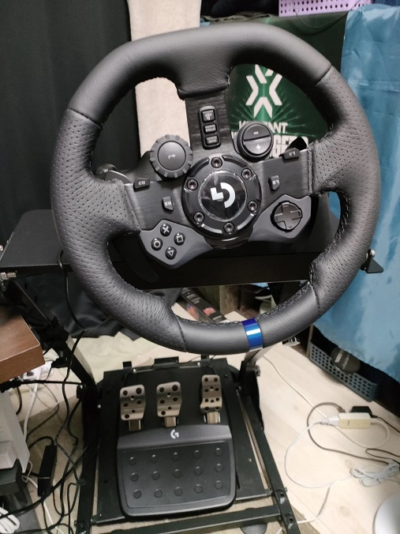
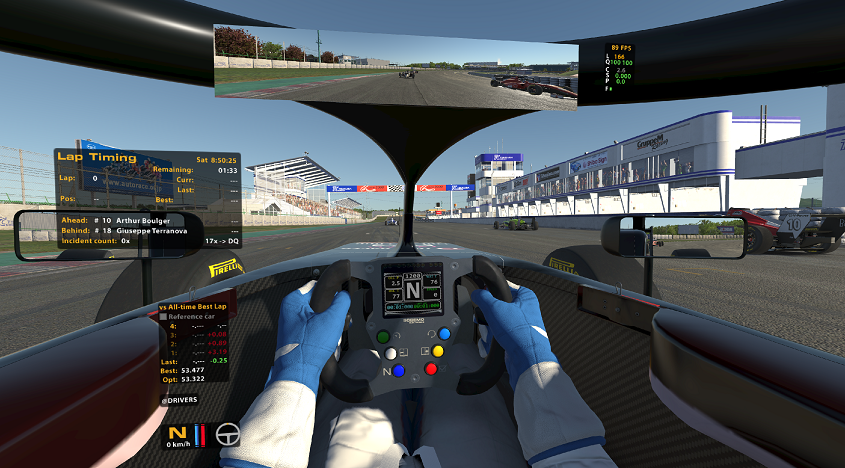
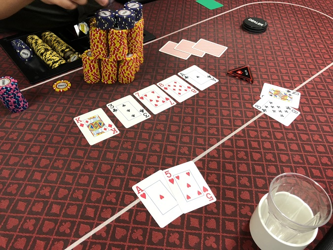
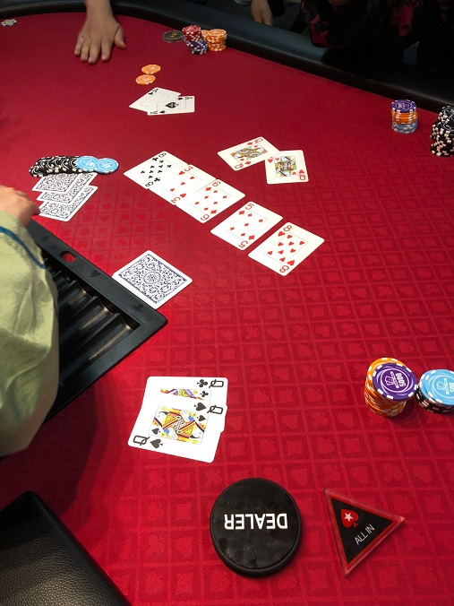

## About me
- FPSとレースシムゲーマー
- 筑波、都内某所院で数学をちくちくしていたはずが、怪電波を受けて、モバイルなエンジニアになってしまった。
- 平日はカフェインと引き換えに賃金を得て、休日はだいたいゲームしてるか寝てる。
- 最近は、VRでガチンコぶーぶーゲームをしてる。

## Favorite

### 数学
- 6年間数学専攻してた。
- 計算機代数が専攻で、だいたいGrobner基底とかその辺。
- おしごとは数学関係ないので、やらなくなっちゃうとほんとにすぐ抜けちゃうよね。かなしあ。

### PCゲー
- iRacing
  - 昔からレースゲーはやってたけど、初オンラインでVR買ったらドハマリしてしまった。
  - こいつのせいで週の初めが火曜日になってしまった節がある（※週替りのレース切り替わりが日本時間で火曜）
  - メインFIA F4, F3。たまにGT3あたりに出没してる。箱、難しいんだよな～。
  - max iRating: 1700後半(2023/4S)
  -  
  - 

- VALORANT
  - 実は Day1勢
  - 一時期までは真面目にやってたけど、最近はまったり unrated 勢になってます。
  - セージOTPではありません
  - maxはアセ1だったはず

- 工業系
  - factorio, satisfactory, Dyson sphere program あたり
    - えんじにゃー必修科目まである

- 音ゲー(IIDX)
  - ド田舎出身だったので、初めてゲームセンターにたどり着いたのが大学時代で、IIDX PENDUAL。
  - 中伝までいったけど、ほとんど最近やっていないコンテンツ。
  - 正規厨して、変な曲ばっかり好きだったのが悪かったかも。
  - BMSは発狂BMSの曲だけやたら覚えてる。
  - やっぱり家とか職場とかの周りにゲーセンないと厳しいね。

- Others
  - Steamの所持リストを眺めてみた
    - Cities: skylines, Core Keeper, DJMAX, Slay the spire, マリオテニスエース（元国内ランカー（？））

### Tech
- プログラミング言語で言うと Go, Pythonあたり
- kubernetes, grafana+lokiとかGitHub Actions芸人のようなCI/CDに興味がある。
- 仕事で言うとLTE, 5Gのネットワークコアが何も分からないし、国内特有の仕様もよくわからない。
- インフラ系で一から鍛えられた結果、石橋を叩いて割らないと落ち着かなくなってしまった。

### ポーカー
- なんか急に身内で流行った時期があって、その時に一番にハマってしまった。
- 一時期は有料英語教材漁って勉強しまくってたけど、最近は全然できてない。
  - 都内のポーカースポット...高いよね
-  
- 

### 競プロ
- 業務プログラミングを初めてからすっかりやらなくなってしまった
- ユニットテスト書くときだけ、「絶対このコード落としてやる」の殺意が蘇ることがある
- 水色だったけど...もう無理だね
- https://atcoder.jp/users/Lithium

## Contact
### GitHub
- https://github.com/azuki774

### fediverse
- もこきー: https://mkkey.net/@azuki
- misskey.systems: https://misskey.systems/@azuki

### Twitter
- もうあまり見てないかも
- https://twitter.com/azuki774s

### VALORANT
- azukicyan#NaruY
