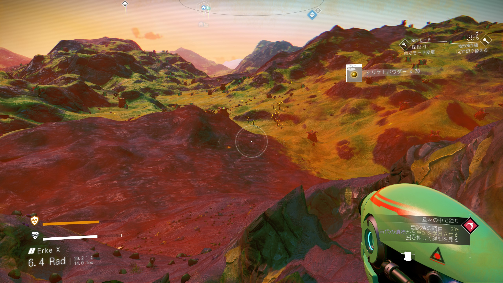
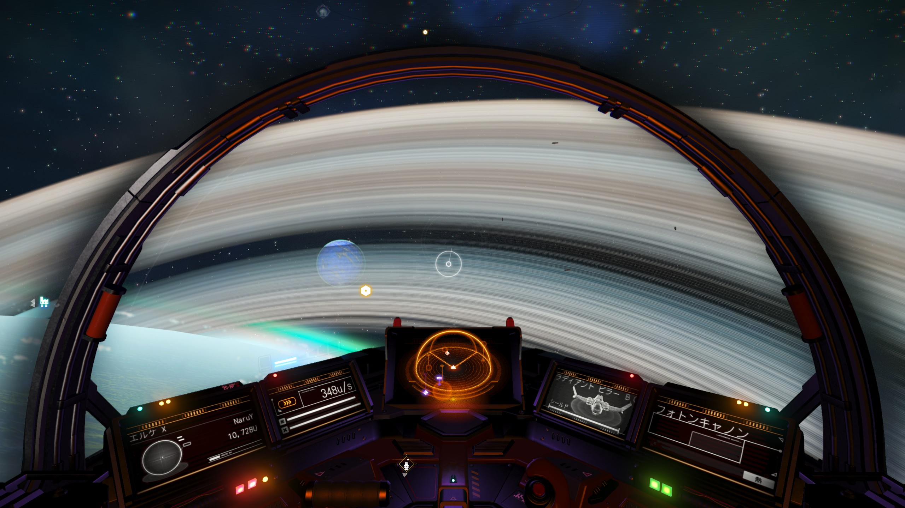
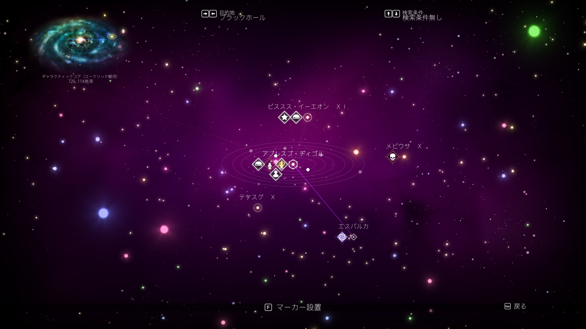
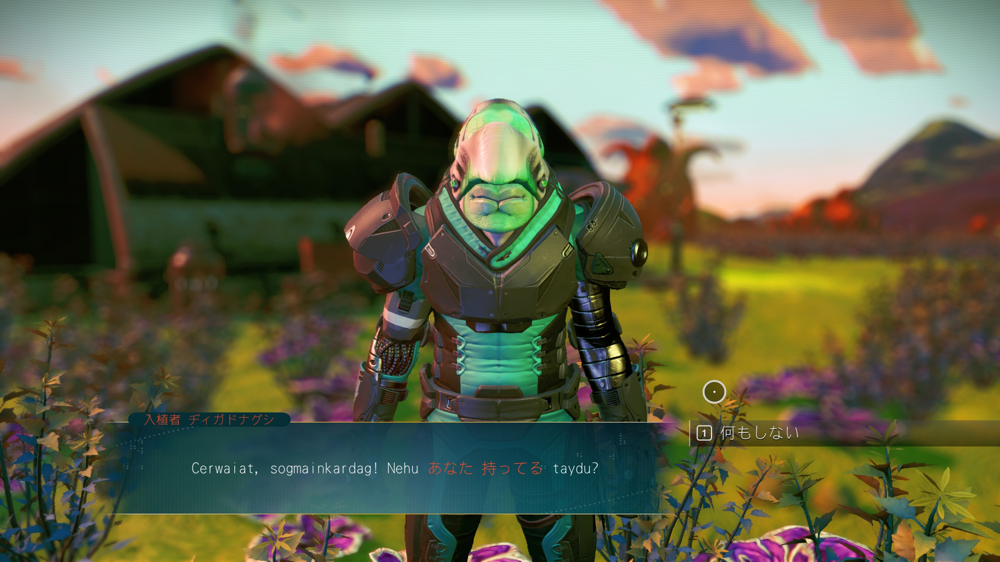

今まで名前しか知らなかったが、2016年に発売したNo Man's Skyを始める。
- https://store.steampowered.com/app/275850/No_Mans_Sky/?l=japanese

自動生成型の銀河系を旅するSFアドベンチャー。
資源ホリホリしたり、海賊宇宙船を破壊したり、何語話してるかよく分からない生物と取引したりする。
発売当初は、バグ&バグ&バグで死ぬほど評価が悪く、日本語環境だと確定フリーズもあったんだとか。

で、このゲームの頭のおかしいところは、発売して7年かけてバグfixと新要素アップデートを繰り返して、
metascore = 61というスタートから、Steam評価「直近：圧倒的に好評」まで盛り返しているところ。

最近だと、2023/08に大型アップデートが入っていて、もう頭おかしいんじゃないかと。
- https://www.gamespark.jp/article/2023/08/25/133364.html

惑星の数は18,446,744,073,709,551,616個あると言ってるし、宇宙船・各種ツールのアップデート、乗り物なども一定の基準下でランダム生成されるので、
果てしなく時間泥棒になりそう。
ちなみに、マルチには対応しているけど、（無条件ではないとはいえ）上の通りとんでもなく広大なので数年プレイしただけでは他の人と出会うことはないであろう...

### 惑星探索

### 宇宙船
- 操作はかなり簡単かも
- 宇宙船ごとに種類があって、レア度があって、スペックもそれぞれ違う。まだ初期機体なので貧弱。

### 恒星系
- この形のマップが出てくるゲームはたいてい神ゲー。Dyson sphere programとか。異論は認める。
- 惑星→恒星→恒星系→銀河→銀河系で宇宙の広さを感じるよな。

### 異文化交流
- これ最初めちゃくちゃビビった。NPCとの会話。
- 作中、いくつか部族が出てきてそれぞれの言語を話すのだが、最初は何も主人公は言語を知らないので意思疎通が取れない。
- アイテムや交流を進めていくと、少しずつ言語を習得することができ、赤字で書かれている通り、単語単語で何を話しているかが少しずつ分かるようになっていく。
- （なんか初学者向けの外国語テキスト見てえだな）

### おわり

とまあ、7年もかけてようアップデートするなあ。最初期にやって掘り投げた人がみたら別ゲーとか思うんじゃないか。そもそも最後のスクショの要素とか最近追加らしいし。

アップデートで追加改善されたゲームといえば、最近発売された [Cities: Skylines II](https://store.steampowered.com/app/949230/Cities_Skylines_II/?l=japanese)
が思い浮かんで、発売日にやってあまりの酷さに大ズッコケして、これも言いたいことがありすぎるので別日にしよっかな...

これも時間かかってもいいから、改善してくれれば良いのだが...シミュレータのコア部分がだめそうだからなあ...

反動で、Cities: skylines の初代を70時間ぐらいまたやっちゃったよ。
