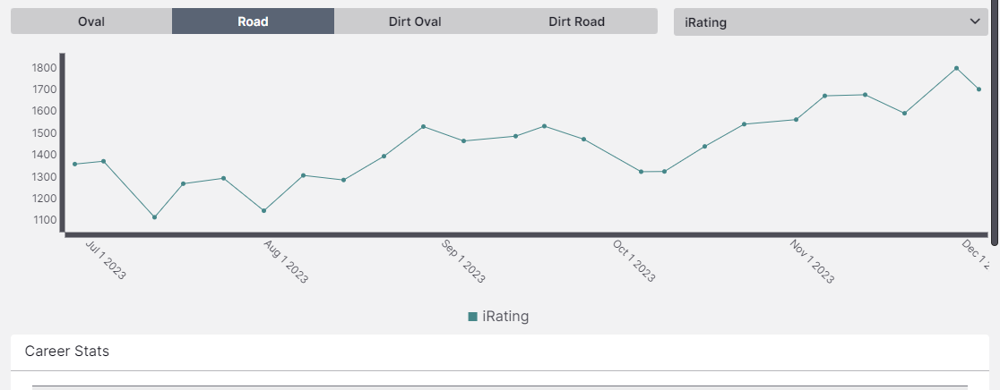
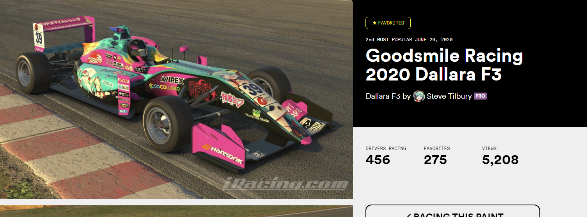
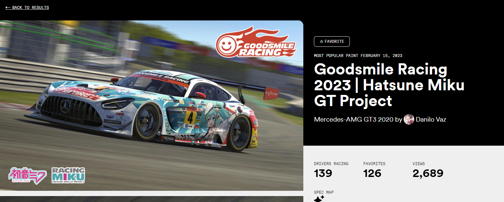
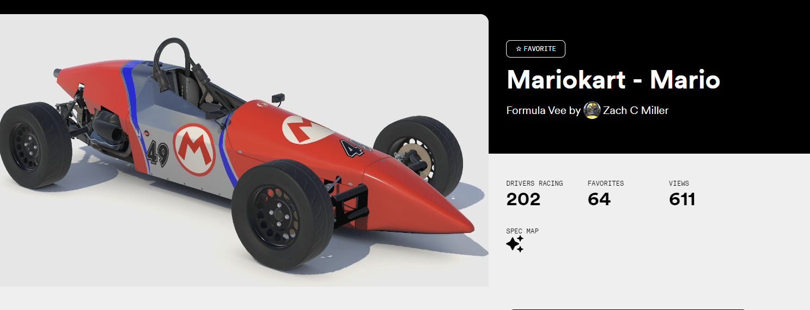

さて、iRacingの話ですが。

[About me](https://weblog.azuki.blue/about/) でも触れていますが、最近レースシムにハマっています。
特にガッツリ iRacing をしているのですが、iRacing の特徴としては、
- オンラインレースシミュレータのプラットフォームとして、15年の実績がある。
- F1とかのガチプロドライバーから、アマチュアレースチーム（実車）や、私みたいなよう分からんエンジョイゲーマーまでいる。
- 完全実名性
- シーズンサブスク + コース + マシンコンテンツ代がそれぞれかかる（ドル建てなのでしんどい；；）
- 日本語情報サイト (https://www.shupop.com/iracing/)

という性質があります。要するにガチンコ

参戦5ヶ月目になりますが、私の環境では
[VR(PICO4)](https://www.picoxr.com/jp/products/pico4) + [G923](https://gaming.logicool.co.jp/ja-jp/products/driving/g923-trueforce-sim-racing-wheel.941-000203.html) の組み合わせでやってます。

レースシム系では、3画面ディスプレイで囲む形でやるのが一般的なんですが、私はVRでやっています。最近増えているとかなんとか。

### VRのいいとこ
- 没入感がある
    - これは当然なのだが
- iRacing のようなレースシムでは、コックピットビューがあるので視界的アドバンテージがある。
    - 少なくとも180度の視界は首で確保できる。横目でも見ることができる。
        - PICO4 の性能がいいのもあるかも
- 意外と3画面同じディスプレイを並べて、さらにそのディスプレイにあうようにコックピット環境を整えるのが難しい。
    - VRなら画面いらず。ゴーグル被って壁に向かってハンドル操作しています。

### VRの良くないとこ
- 外部ツールが使いにくい
    - HUDとかで拡張ツールや、追加で情報を提供するテレメトリとかが開発されているのですが、VRだと使えず...
- キーボード操作したい場合、場合によってはゴーグルを外して言ったり来たり
    - まあ、これはしょうがないか...

アトランタを初見で走った動画でも貼っておこうかな。
- https://www.youtube.com/watch?v=d-Mi89E8mXA

## 2023/Season 4 の成績
iRacing のシーズンは12週で構成されています。私が初めたのは Season 3の途中だったので、初めてのフル参戦。

このグラフのiRatingっていうのがいわゆる速さのレートなのですが、1350スタートで今1700。絶賛上ブレ中。

どうやら、日本人だと700番ぐらいなようです。まあこんなクッソ敷居高いゲームでこの順位なら今のところ満足ですね。。

## カテゴリ別感想
以下、カテゴリ別の感想。備忘録です。

### FIA F4

- 一番楽しい。
- 最初の頃は、ダウンフォースが足りなくって吹き飛んでいったり、ロースピードだとデフの関係で、アクセル残さないと盛大にスピンする挙動に悩まされました。
    - 結局、他のハイパワーマシンと比べてブレーキは残しすぎちゃだめってこと。
- コース（週替り）にも寄るが、かなり人気のカテゴリで、マシンが難しすぎない分、マシンをちゃんと走らせるだけでなくちゃんと接近戦ができる所が面白さなんでしょうね。
    - はじめの頃は引いてばっかりでしたが、ちゃんとブロックラインを取った方が、意思表示として明確で危なくないケースが多いことに気づいた今日このごろ。
- Season 4フル参戦(8/12　週）、おそらく来年もフル参戦する。

### F3

- これも今期からフル参戦した。
- F4より早いけど、ダウンフォースがあるから単独で走るだけなら同じぐらいの難易度かも知れん。
- ただし、速度域の関係で圧倒的にサイドバイサイドの恐ろしさが上がるのと、1レースがおよそ30分フォーマットになるのが大きな違いっぽい。
- 多分これがフォーミュラの中で一番賑わってる。

### FIA GT3

- iRacing 最も人気なコンテンツ
- フォーミュラメインでやってるので、箱レースが死ぬほど苦手で全然結果が出なかった。
- ブレーキの残し方が違ったり、視界が全然違ったり、そもそもスタート方法もローリングだし、ワンメイクじゃないからいろんな車選べるし、、といろいろと勝手が違う。
    - 来年はフェラーリでも買うか・・・上位勢フェラーリばっかだもんな・・・
- 来期はやりたいコースだけスポット参戦しよう

### Formula Vee

- 走っててめっちゃ楽しいんだよお...でも難しすぎてちっとも安定しないからろくにofficial出ていません。
- もっぱらプラクティス専用マシン。楽しいよ。
- あまりにも楽しいけど、あまりにもムズいので、これをルーキーリーグに置く運営はどうかしてる。

## 来シーズンの目標
- Safety Rate A 維持
- iRating 1700 維持
- F4 / F3 （レギュレーション上の）フル参戦
