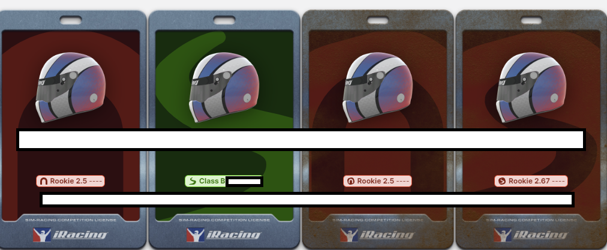
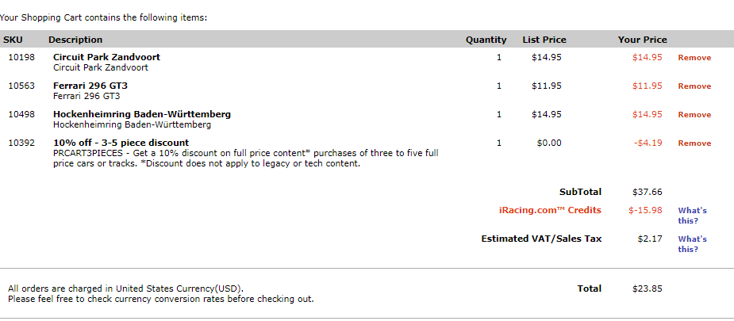

今日からiRacingが2024 Season1が始まったので、何出るかを決めていく。
必要以上に買わないようにな。。。円安が厳しい。。

### その前に

Aライセンス剥奪された。

ロスタイムの13週目、Officialレースと気づかずに１レース出てしまったところまでは良かったが、見事な外人ニキのタックルによって
私のSRをモリッと持っていかれてしまい...めでたくAランクライセンス剥奪されました。

13thにAランク持ってかれるの聞いたことないぞ、、しかも明らかな他責で・・・
今でも思い出してブチギレそうですが、幸いAライセンスレースに出る予定はないので、この辺で怒りを沈めておきます。

### 出るやつ決める
基本、持ってるやつ重視でいくら今期かかりそうかざっくり計算しておく。
まとめ買いすると安くなるので、欲しいものはまとめて買っておく。

#### FIA F4
10/12 既に持ってた。
持ってないのはザントフォールトとマウントパノラマ。
まあ、マウントパノラマは危ないからでなくて良いやｗ

#### F3
7/12 既に持ってた。
意外と足りない。
ホッケンハイムリンク、マウントパノラマ、ザントフォールト、Mugello（どこ？）、インディアナポリス

最低限1つ買えば足りるけど、ギリギリなので2,3個買っておきたい。一旦保留。

#### Super Formula
10/12 意外とあるけど、あんまりフル参戦するモチベはない・・・難しい・・・

#### GT3
8/12 これもフル参戦する気はないんだけど、既に持ってたAudiをまーた型落ちにされてしまったので、新しいフェラーリでも買っておくか。

GT4, SFその他諸々はまあ持ってるコースでノリでスポット参戦することにしましょう。

というわけで、

円安、、、許さん！！！！！！！！！
