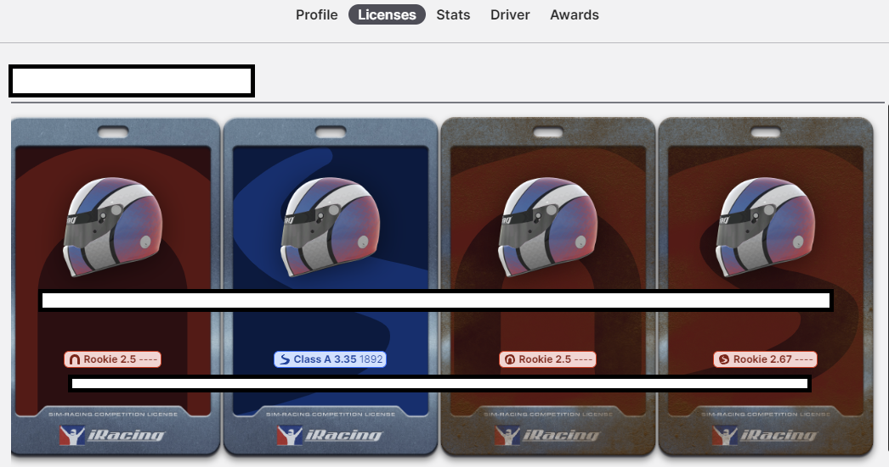
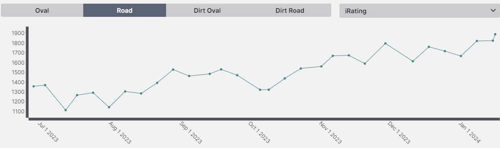
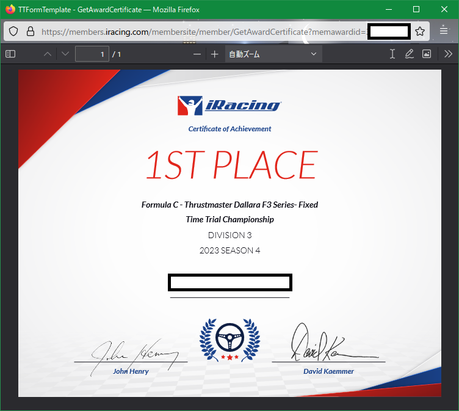

これを書いている時点で、12週分の6週目に突入したところ。

Season 1途中時点で見事に刈り取られて、Bライセンスに叩き落されたボク (Ref: https://weblog.azuki.blue/p/20231212/) もどういうわけか、特別昇格でAライセンスに復帰した。ほんなら落とさないでもろて。

相変わらず、専らFIA F4と FORMULA C(F3) で稼いでいる模様。絶対箱乗ったら一発でスコア落ちますね。

iRatingも初期値1350から、ついに1900手前まで伸び伸び。

- 

Safety Ratingは、
B 2.6ぐらい（スタート）-> B 4.0 = A 3.2ぐらい？ -> A 3.35 と推移しててなかなかいい感じ。

iRatingの方も、スタートいくつだったかな・・・
1600 ~ 1850ぐらいを推移してる感じ。画像のは最高値なので今の状態じゃないのであしからず。

どうやらアクティブユーザが18万人ほどいて、30000~40000位ほどらしい。
日本人だと800番台なのかな。

推移としても全体見るとものすごく順調。
- 

ここからは、課金とかしてちゃんとプロとか上手な人のセッティングを買ったり、動画やらリプレイを買ったりしないと伸びにくいのかな・・・？

今の伸ばし方っていうのも、明らかにレート帯に対してペースがあるわけではなく、とにかくセーフティに走って「大きく減らす」をしないことによってレートを保っている感じ。Safety Ratingにも出ている。

この手のゲーム、というかレースゲームだと、誰も前に行かせん！みたいな魂な人たちが多そう。
ただこういう形で可視化されると、どうしても打算的に動いて、周回遅れとかが来ても変に絡むよりはさっさと行かせるっていうのも、リスクヘッジとしてありなのよね。

最近は根性ブロックとかもすることも出てきたから、レートにペースが追いついてきたらそういう機会も増えてくるのかな・・・というところ。

今シーズンもFIA F4もF3も完走賞（参加率66%）もらえるように頑張っていきたいと思います。

## おまけ
- 

SR稼ぎにOfficial Time Trialをやるんだけど、参加人数があまりにも少ないためか、F3 DIVISION 3で1位になってた！？人類やらなさすぎでしょ。

なんか他にも色々2位あたりを量産してたけど、ここまで簡単に取れるとそこまで価値はなさそうね。
