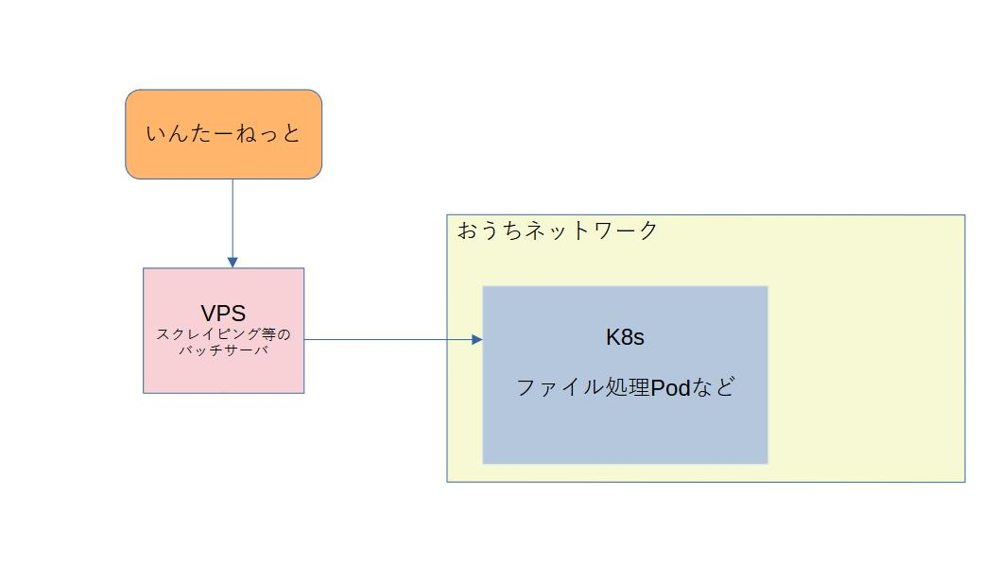
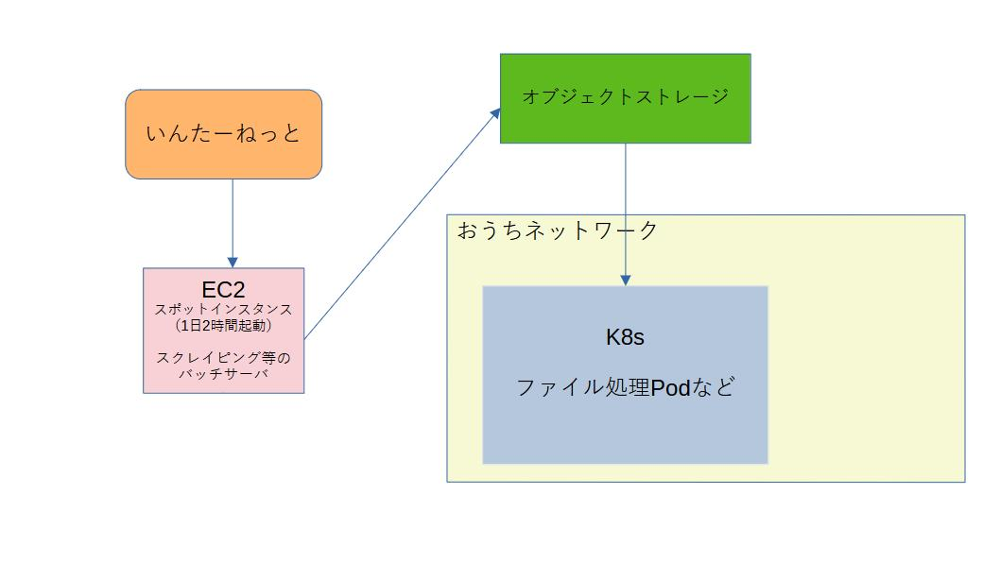

- [前のやつ](../20231208/)の続きかも

## 概要
スクレイピングやmisskey関連のちょちょっとしたバッチを動かすためのVPSの契約が切れそうになったので、ホスト構成を再検討した。

## 現状


- VPS
    - 3コア4GBぐらいのスペック
    - 常設VPS（停止していても課金されるタイプ）
    - バッチが4,5個動いているが、全体の所要時間としては、30分かからないぐらい。
    - コア機能でいうと、スクレイピング（Selenium + それを動かすPythonスクリプト）して、ファイルをVPS上のディスクに保存する。
        - だいたいこんな感じの `compose.yml`
        ```
        version: '3'
        services:
        python-scripts:
            image: hoge
            container_name: python-scripts
            env_file:
            - /home/azuki/service/fetcher/hoge.env
            environment:
            TZ: Asia/Tokyo
            volumes:
            - /home/azuki/data/fetcher/hoge/:/data/

        selenium:
            image: selenium/standalone-chrome:4.1.4-20220427
            container_name: selenium
            ports:
            - 4444:4444
            - 7900:7900
            volumes:
            - /dev/shm:/dev/shm
        ```

- k8s
    - おうちで動いている
    - Podでは、VPSにスクレイピングしたファイルをscpで取得しに行き、そのファイルを加工・処理するもの。

## 要件
- VPS部分をいい感じにして安くすること。
    - 例えばIndigoだと、4vCPU, 4GBで1,630円ほどとのこと(2024/02/04)
        - https://web.arena.ne.jp/indigo/price/
- スクレイピングバッチのスペック的には、瞬間火力が必要
    - 2コア4GBあたりが必要か。
    - `Docker`かつ`Selenium-standalone`を動かすとなると、ある程度のスペックが必要。
- 完全に自分用なので、動かない日が数日あっても良い。
- バッチが動いていない時間（1時間ぐらいか）以外は、このホストは用なし。
- おうちネットワーク「以外」の部分にも、スクレイピングしたファイルが保管されていること。
- パブリッククラウドをIaaS以外で使ったことがないので、AWS/GCP/Azure等々を使う場合は、高度な機能を組み合わせなくても出来ること。

## 検討
1. `compose.yml` で動かしているコンテナを1つにして、CaaS的なコンテナ1つをスポットで起動できる基盤に移行する。
    - pros
        - どう見てもバッチサーバの移行先として自然な選択
        - 起動時だけお金がかかるシステムであるので、料金節約効果は自明。
    - cons
        - `compose.yml` の中身を1つのコンテナにしなければならない
            - [selenium-standalone](https://hub.docker.com/layers/selenium/standalone-chrome/latest/images/sha256-af60bc8b734d7894061d3a220423e905fa158d054786b5c672e9c2e3d8cab78a?context=explore) の `Dockerfile` を見るとかなり難解。
            - このコンテナをベースに、「Seleniumを操作するスクリプトをデプロイする」「それぞれをデーモン化して同時起動させる」必要があり難解。スクリプトを改修したり、Seleniumのバージョンを上げるたびに`Dockerfile` を編集する（=Seleniumの`Dockerfile`に依存する）ことになる。
                - 厳密に言うと、複数コンテナを建てて協調できる基盤もあるはずだが、パブリッククラウドが初めてなのでハマりそう。
                避けたい。
2. AWS/GCP 等のスポットインスタンスを使う + 定時で起動・終了する仕組みを作る
    - pros
        - AWSだと「スポットインスタンス」、GCPだと「スポットVM」を使うことによって、大幅に基本料金を抑えることが出来る。
            - むしろこれを使わない場合は、素直に現行のVPSを使うほうが安い。
        - ものとしては、上記の`compose.yml`はそのまま使えるので、**バッチ起動に関しては** 移行は楽。
    - cons
        - 「定時で起動・終了する仕組みを作る」のトリガーを仕込む方法を勉強する必要がある。
        - VMが起動していない時間は、スクレイピングファイルが取得できない。別途、オブジェクトストレージ等に結果を保管する必要があり、そこを作り込む必要がある。
        - 定額ではない
            - そう高くはつかないと思うが・・・
            - スポット系の割引率も可変のため、料金は確定しない。
3. 現行維持
    - pros
        - 楽
    - cons
        - Indigo: https://web.arena.ne.jp/indigo/price/
        - ConoHa: https://www.conoha.jp/surcharge/
        - などのVPSも昨今の事情で軒並み値上げしており、今後も高くつくと思われる。

1 が技術的に厳しいそうなので、2か3になるが、技術習得も兼ねて今回は2で実装することにする。


## 実装
AWS/GCP のスポット系インスタンスの料金を比較したところ、今現在だとAWSの方が安かったので、AWSとした。
`アジアパシフィック (大阪) ap-northeast-3` の `t3.medium` を使う。現在価格は、`$0.0124`（スポットでないものと比べて 77.16% 節約）とのこと。諸々他にお金がかかることを加味しても、大体1200円ぐらいか。スポットでないと4000円超えてきそう。

ただし、上の計算はスポットインスタンスでかつ、起動終了を制御しない場合であって、バッチが起動する時間・終了する時間に合わせて、[EventBridge](https://aws.amazon.com/jp/eventbridge/) を使って制御する。起動している時間は多めに見積もって2時間程度。1/12の料金になることを期待する。

EventBridgeは当然何もわからないので、先人の知恵に従いそのまま実装した。参考のリンクは下記に貼っておきます。

---

もう1つ課題があって、バッチが終了したあと、おうちネットワークでk8sを動かしているPodが取りに来るときにはVMが起動していないので、結果をオブジェクトストレージに上げる必要がある。
普段、DBのバックアップ先として、オブジェクトストレージに[wasabi](https://wasabi.com/ja/)を使っているので、今回もそこを経由してファイルを受け渡しすることにする。

EC2のAMIは`AmazonLinux`なので、最初からawscliが入っていて、
```
aws s3 cp ${SRC_DIR} "s3://${BUCKET_NAME}/${REMOTE_DIR}" --recursive --endpoint-url="${BUCKET_URL}"
```
みたいな形で取得したファイルを投げ込むだけで終わり。嬉しい。

k8s の処理Pod側でも、ホストから scp で直接取得ではなく、オブジェクトストレージから取得するように変更する必要があり、パスの設定などがものすごくめんどくさかったので、しょうもないので割愛します。helm-chartsを雑に書いたのが悪いね。




結局こうなった。
しばらく検証用のnamespace、オブジェクトストレージのBucketにて動作させて、問題なさそうだったら実運用している環境にも適用しようと思う。

## 課題
- 結局いくらかかるか分からない。
    - 計算上は明らかに今よりも安いが、クラウドは謎なので1ヶ月動かしてみて請求を見ないとなんとも言えない。
- EC2のスポットインスタンスをアップデートしたいときに、VMが落ちているとアップデート出来ない。
    - Ansible で主に構成管理しているが、当然VMが落ちていればコケる。
        - 対策としては、中心のAnsibleからは更新対象から外して、このホストだけはホストが立ち上がったタイミングで、`git clone` して最新版を取得し、自力でアップデートしてもらってからバッチを開始するなどがあるか。
        - 地味に変更頻度が多く、スクレイピング部分の改修をしたときに、Dockerイメージのバージョンアップなどを入れるなど。
- 今回だけの課題ではないが、取得が失敗することは多々ある。これは親ページの変更の場合もあるし、スポットインスタンス特有の可能性もある。アラート発報機能を作りたい。
    - 連続でn日失敗したらアラートを鳴らすなど。
    - おうちネットワーク上で、grafana + loki + prometheus + alertmanager の鉄板構成で構築しているため、そこに拾ってもらえる形で、ファイル数などを吐き出す metrics サーバを実装すればよいか。
        - これもこれで難しく、やはりこのスポットインスタンス上で動かすわけに行かない（VMが落ちていたらmetricsを吐けなくなるため）
        - 取り込むk8s側に新規実装すればよいが、どちらにせよ作り込みが必要。

## 参考
- https://docs.aws.amazon.com/ja_jp/AWSEC2/latest/UserGuide/Stop_Start.html
- https://qiita.com/mksamba/items/3f597572928befac2622
- https://techblog.techfirm.co.jp/entry/aws-ec2-automation
