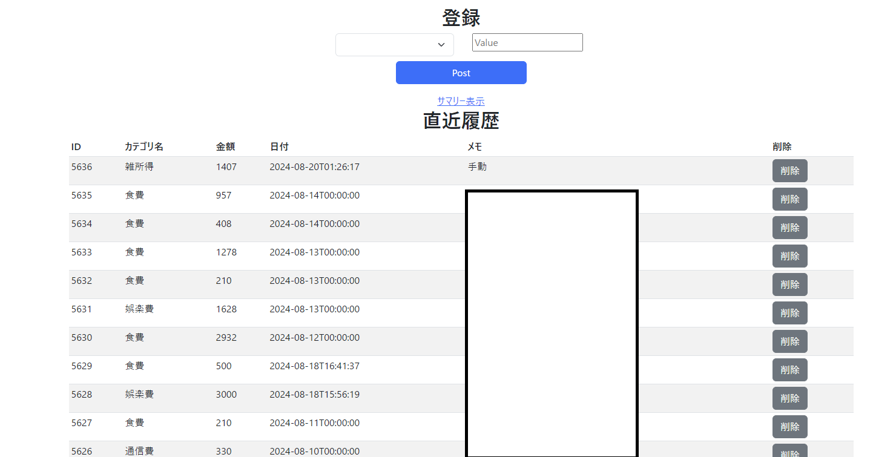
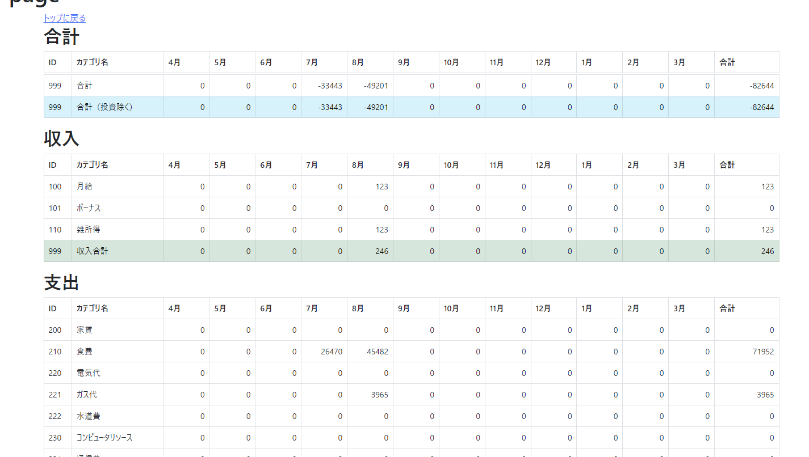

## 概要
Nuxt3 入門した

#### なんで
- ~~仕事で無茶振りが来たので~~
- 前までの記事 ( https://weblog.azuki.blue/p/20231204/ ) などで触れている通り、おうちで家計簿記録のために、自作プログラムを作っていたのだが、そのフロントが Flask で完全に html を作るタイプのものだったので、いわゆるWeb系に一つ触れておきたかった
- [オレオレ家計簿サーバー](https://github.com/azuki774/mawinter-server)
- [Pythonフロント](https://github.com/azuki774/mawinter-web-py)
    - いわゆる jinja2 でのテンプレート生成

### そもそもWeb系なんも分からん

#### 分からんものたち
- そもそもNuxtの位置づけが不明すぎ。Vue / Vite / TypeScript このあたりの依存関係というか階層関係というか
- CORS解消のための解決方法（裏側にAPIがいるけど、ポートも何もかも別環境だし、APIを外側から叩きたい場合はどうすれば？）
    - Webサーバが一旦受けて、代わりに裏のAPIを叩いてほしいんだけど
- てかこのブログも hugo で動いているけど仕組みがあんま分かってない。

#### どうするか
- ググったら、Goとかで書いたときにはめったに遭遇しなかった、hogehogeエンジニアとか良くわからないインチキ記事がいっぱい出てくる！！！！なんで！！！Web系のときだけ！！！
- 良さげの本を買ってみた
    - https://www.amazon.co.jp/Nuxt-3-%E3%83%95%E3%83%AD%E3%83%B3%E3%83%88%E3%82%A8%E3%83%B3%E3%83%89%E9%96%8B%E7%99%BA%E3%81%AE%E6%95%99%E7%A7%91%E6%9B%B8-WINGS%E3%83%97%E3%83%AD%E3%82%B8%E3%82%A7%E3%82%AF%E3%83%88-%E9%BD%8A%E8%97%A4-%E6%96%B0%E4%B8%89/dp/4297136856
        - でもこれも結局、最低限 Vue とかWebサーバ内のルーティングの仕組みとかがある程度わかる前提だよねって感じの本だった。
        - その前提を調べようとすると、アフェリエイト系のインチキみたいな記事がいっぱい出てくるんだよな...

#### わかるようになったこと
2週間ぐらいがんばった。

- 目標はおうち家計簿サーバのフロント実装。登録と削除、サマリー（年度ごとの参照）
- https://github.com/azuki774/mawinter-front/tree/v0.5.3
    - えいえいっと完成
    - bootstrap も取り込んでそれっぽい画面にしてみた。
    - 
    - 
        - 画面はテスト環境

- 目標としていた登録、削除、サマリー参照。これらをWebサーバをプロキシにして、裏側のAPIを意識せずにエンドのクライアントからたたくことがで画面が生成されるようになった。

#### わかってないこと
それ以外のこと。1つずつ暇な時 && やりたいことをやろうとしたときにぶつかったものから挑戦したい。

- CSSが全然理解できない。めっちゃずれる。
- モーダルとか画面を出したときに、親と子のコンポーネントの関係、データの受け渡し
- 非同期処理の描画待ちの調整、画面のリフレッシュ
- レンダリングのライフサイクル？レンダリングの種類によって、画面が2回更新されたり、画面が一部しか更新されなかったり、データ未取得の状態で画面を出そうとして真っ白を表示したりしがち

### 感想
2週間ぐらいでも、外部APIを叩くプロキシとなるWebサーバ建てて、拾ったCSSでそれっぽい画面を出すぐらいはできるんだなと思いました。フロントの人はこれの1000倍ぐらい泥臭い調整をしていてすごいです。
