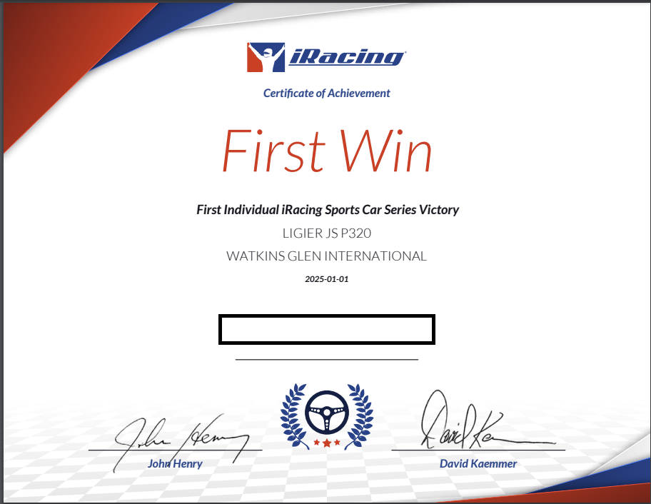
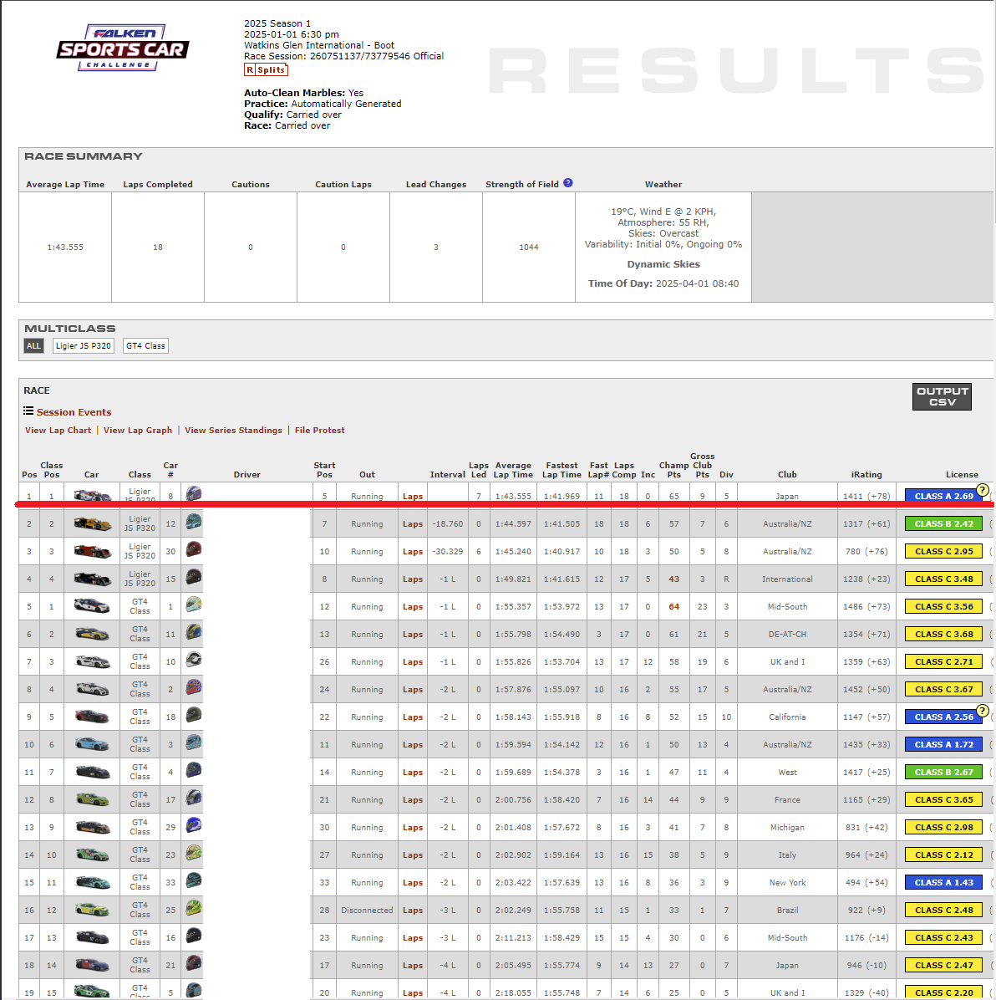
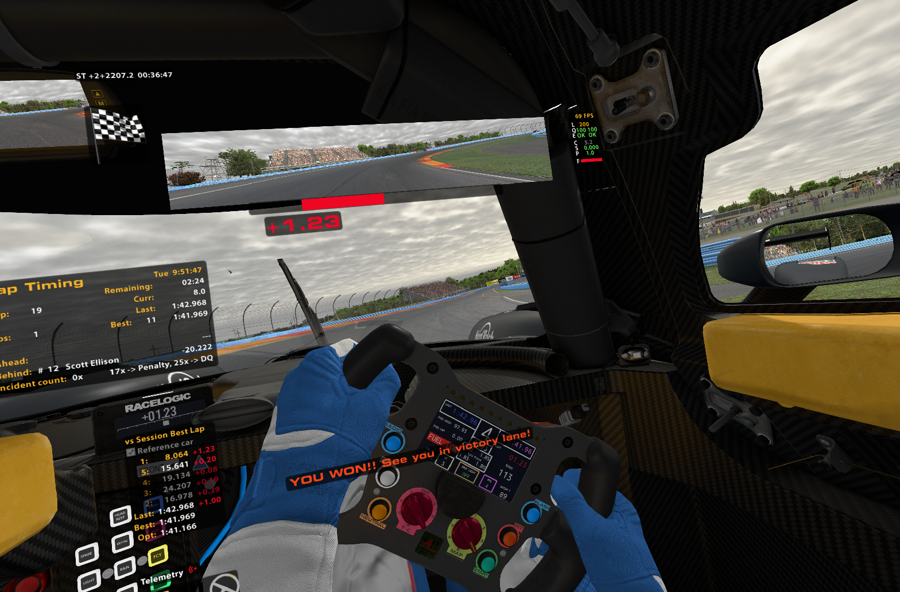
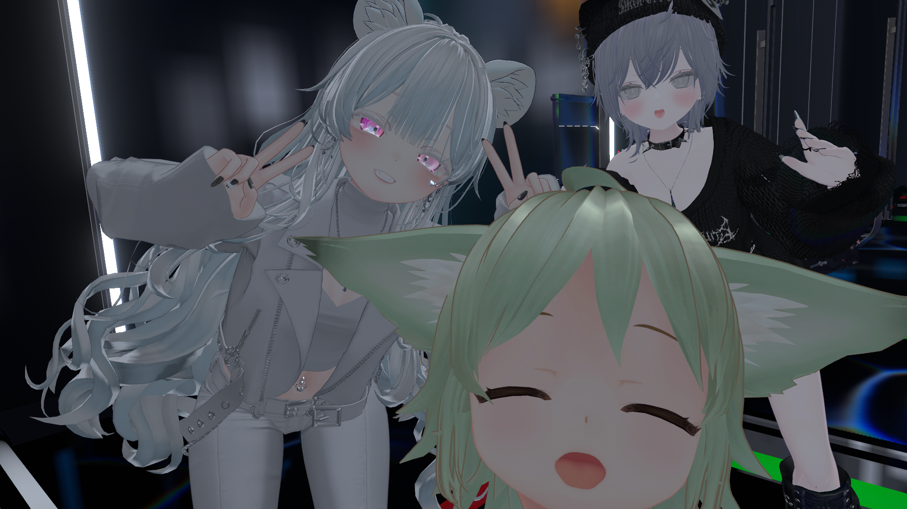
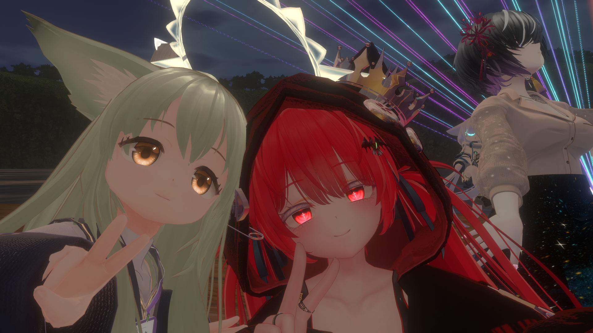

## Top
ブログサボってたから書こうと思った。2024年のことを書こうと思った。
何も思いつかないので、つまりはそういう年だった。

ここ3,4年のメンタル悪化がさらに加速して、本当に新しいことを始めることも、今までのことを維持することも出来なかった1年でした。特に、年途中、数ヶ月仕事が出来ないほど身体・精神ともに動けなくなってしまい、今は仕事に戻っていますが、とてもじゃないけど全快の兆しは見えない状態です。

### 仕事
前述の通り、今年はなにもなし得た記憶がありません。特に仕事休んじゃったため、（表向きの評価は悪くなくとも）後々に響いてきそうだな～と思ってます。細々とした仕事を見つけて拾い続ける小人ムーブの能力は上がってきた気がしますが、それならそれで、そういうことがきちんとできる職場を探したほうがいいかな～と思っています。

実際問題、満員電車に揺られて毎日仕事をするのはなかなかしんどいものがあり、来年度の動き次第では転職もそれなりに視野に入れているところです。（業界が少し特殊なのであれなんですが・・・）

### ゲーム
FF14とiRacingと、11月頭に始めたVRCがホットトピックです。

- FF14はようやく最新パッチにたどり着き（1000時間・・・）、初めて新パッチの初見PTで楽しむことが出来ました。24人初見アライアンスのわちゃわちゃ感はあの1日しか楽しめなさそう。大変良かったです。

- iRacingは、途中かなりサボりました。あんまりにも成長できている気がしなくて、相当萎えていたからです。もう日本200位台には戻れないです。
年末年始の休みで少し再開して、LMP3/GT4の混走にハマったので、しばらくはそのあたりも含めて楽しもうと思ってます（フォーミュラほど根つめてレート上げてないのでのんびり）。
正月早々、LMP3/GT4混走のファルケンカップで総合優勝出来たので幸先がいい。今年も頑張ります。

    - ファルケンカップ初優勝どころか、スポーツカーカテゴリ初優勝です。（下位divだけども・・・）
    - 
    - 
    - 

- VRCは11/02に初めて、12/11にKnown Userになるほどハマってしまった。VRCの持つコミュニケーションの広がり方のヤバさに横転。Twitter（自称X）を中心に使わなくなってから、misskey(.systems)や別のfediverseで一からのコミュニケーションを始めていたのですが、明らかにその時の広がり方とは格段に違う。

- 特にここまでハマった要素として、自分の中で音楽を聞く文化が出来たこと。今まで音ゲー曲ぐらいしか聞く文化がなく、しかもゲーセンとはかなり離れてしまったので、本当に昔のアニソンを聞くぐらいしかしてなかったのですが...。VRDJイベントを回るようになって、めっきり作業用BGMと仕事中、通勤中の音楽が変わってしまいました。聞く方なのでオールジャンルでやらせてもらってます。といいつつ、ハードコアとユーロビートを良く聞いている気がします。<small>ユーロビートの人は濃いオタクが多すぎる</small>
    - 緑の子がボクです
    - 
        - お前最高や
    - 
        - この2ヶ月、More One Night何回聞いたか分からない
    - ほんとうに「いいはなし」

- とここまではいいのですが、なにせ人間関係の構築と、他人との比較の仕方に難があるあずきさん、リアルでいつも感じている感情を早くも感じてしています...しょうがないね。
    - 私の身の回り、なんでそんな多才なの？
    - なんでそんな苦しいことを隠し通せるの？
    - なんでそんな新しいことに挑戦するパワーがあるの？
    - どういうところで育ったら、そんな知識あるの？
        - なんで私は学生時代、なにもないところに幽閉されていたの？
        - なんで何もこれまで手につけたことが何も成功できないんだろう？
    - あずきさんにはもう新しいことに挑戦できるバイタリティがない..
        - 興味があって出来そうなことは、もうことごとく色々な理由で続かなかったから
            - 今から始めるとなると、更に条件が厳しいだろう
        - 下積みになる知識がなさすぎる
            - 環境的要因、性格的要因、色々あるけど学生時代までのことで残っていることは数学ぐらいで、社会人になってからは仕事以外の記憶がない。何をベースに始めたらうまくいくのだろうか。
    - このしんどさを共有したい

### まとめ
というわけで、変わらず、というか過去一で厳しい年、2024年になってしまいました。
2025年こそは、なにか新しいことを始める・・・は出来なくても、
- 今までMPが足りなくて辞めてしまったことを再開する
- 楽しむべきところは、精一杯楽しむ

あたりを目標にしたいと思います。あとは人様に迷惑をかけない。
I hope that a new year become full of good things. 
