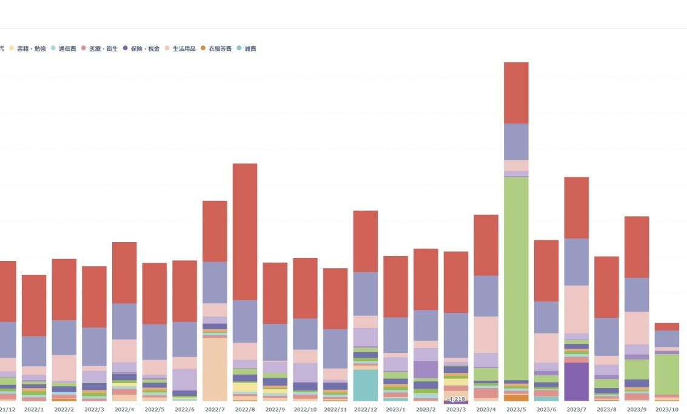

- あずきハウスでは半自動家計簿システムを作って、3年ぐらい運用しています。
    - [azuki774/mawinter-server](https://github.com/azuki774/mawinter-server)
- 最初はエクセル管理だった家計簿が、今ではおおよそ8割以上の買い物が自動的に家計簿に記録されるようになっています。
- ~~社畜による~~技術習得とおうち家計簿システム実装による知見が交互に生きたところは少なからずあります。
今回は、その時系列に沿っておうち家計簿システムの成長を紹介します。

## 作りたいもの（当初）
- 少なくとも日単位でデータ登録管理し、月/年単位で集計する。
- 品目はカテゴリ（食費、生活費とか）ごとに管理する。
- 少なくとも入力は、出先のスマホでもできるようにしたいなあ。

## 第一世代

### 構成
Googleスプレッドシート

### 説明
- スプレッドシートに1列にカテゴリ（食費、とか）と金額と料金を書いていって、シート内の関数で集計するだけのもの
- 要するにエクセル集計

### トリガー（なぜやったか）
- たしか就活が終わって、本格的に社会人生活ができるか不安になって一人暮らしの支出を計算しようと思ってエクセルで集計し始めたのが最初。
- 「集計シート」と、「記録シート」に分けていって、「食費、300円」「生活費、200円」みたいに記録していけば良い。

### 感想
- 当初は真面目だったのでちゃんと毎日記録してた。
- 当時からレシートとか読み取って記録するアプリとかあった気がするけど、どうやって種類別に分けるんだろう...？みたいな気持ちで使ってなかった。

## 第二世代

### 構成
Googleフォーム + Googleスプレッドシート + GAS

（移せるところがないかも）

### 説明
- 集計部分は先程と同じ
- アンケート形式のGoogleフォームに金額等々を投稿することで、Googleスプレッドシートの「記録シート」に末尾に追加挿入するようにした。
    - Google App Scripts(GAS) がフォーム入力されたときをトリガーにして、Googleスプレッドシートを動かせる
- ロジックは、「記録シート」の最後のセルを検知して、末尾のセルに情報を記録する仕組み。

### トリガー（なぜやったか）
- やっぱシートに１行ずつ入れていくのがしんどい。
- 出先で記録するとして、あの重いGoogleスプレッドシートのセルに2,3個記録していくのがスマホだとなかなかの苦行だった。

### 感想
- まだこの頃は学生だったはず。
- 初めて競プロ以外のプログラミングをした気がする。ノリでもなんとかなる。
- 楽になったとは言え、「食費→200」「生活費→210」のようなコード体系を取っていたが、その入力がなかなかにめんどい。

## 第三世代

### 構成
APIサーバ + DB + Googleスプレッドシート + Googleフォーム

### 説明
- データの本体がスプレッドシートではなく、MariaDBになった。DBへの入出力はAPIサーバ(Go)を介するようになった。
- API+DB構成になったのに伴い、スプレッドシート上では計算せず、あくまでAPIの返した結果をそのまま表示するだけの表になった。(別途 Pythonスクリプトを実装)
    - [azuki774/mawinter-gss](https://github.com/azuki774/mawinter-gss)
- フロント部分をGoogleスプレッドシート（家計簿記録閲覧）とGoogleフォーム（新規登録）に委託している感じ。APIを叩くだけマン。
- 入力データが不正でAPIから400などが返ってきたとき、DBにデータが入らないが検知する術がなかった。

### トリガー（なぜやったか）
- このあたりで社会人生活が始まって、数ヶ月の~~虚無~~マナーとかの研修が終わったあたりだった。
- httpサーバ初めて建てたところから、SQLを初めて書いたり、Dockerで構築してうんぬんかんぬんを学んでので早速取り入れてみる。
    - 1,2ヶ月だっただろうか

### 感想
- そもそもこれまでhttpサーバも建てたことないし、SQLも書いたことがなかったので全部「なんも分からんズ」の顔をしてた。
- まだまだ難しいことばっかりだけど、これが基本的なWebサービスやらなんやらの形なのか！となってようやく！エンジニア超入門！を達成した気がするのがここ。 
- DBのインデックスの張り方とか、テーブル設計とかﾑｽﾞｶﾁｲﾈｰという気持ち
    - 趣味開発で、1人用なのでまあまあ適当でもいいけども
- あとは地味に今までエクセルに書いていたレコードを、DBにマイグレーションするツールを作るのがめんどかったかも。
- 現代の新卒社会人はコンテナネイティブ世代かも

## 第四世代

### 構成
APIサーバ + DB + Googleスプレッドシート + Webサーバ（Flask、データ新規登録、一部閲覧用）

### 説明
- データの入力がついに自作ページ(Flask)になった。
    - https://github.com/azuki774/mawinter-web-py
- フロントは一切書いたことがなかったので、本当に2000年初頭のプログラミング講座みたいな殺風景なページになってしまっている。
- APIサーバへのデータ授受は問題なく完成したので、一旦は目的の機能を自前実装することが出来た（嬉しい！）。
- その後、[みすてむず](https://misskey.systems) の方にも色々聞いて、bootstrapを導入した
    - 「それっぽいデザイン」が完成。よく見るやつだ！

### トリガー（なぜやったか）
- リストで選択して「食費」「生活費」などのカテゴリが選べないと、スマホで入力するのはつらいかも・・・
- ちょっとフロントを勉強してみたい。
    - Vue3？とかなんとか触ってみたけどHello World以外のことが出来ない・・・
    - Flask だと Pythonで書けるからノリでやってみましょ

### 感想
- だいぶ入力しやすくなった。
- 作ってみて改めて感じたのが、PCで操作するときと、スマホで操作するときでものすごく操作性だったり見え方が違うので、世の中のモバイル端末のページ対応ってめっちゃくちゃ難しいんだなあと。
- Vue3みたいなフレームワークにはいずれ挑戦してみたいけど、、一旦保留かな？
    - なんかお仕事で使う羽目になりそうな気がしないでもない。誰か助けてくれ。

## 第五世代

### 構成
APIサーバ + DB + Googleスプレッドシート + Webサーバ（Flask、データ新規登録、一部閲覧用）+ マネーフォワード

### 説明
- マネーフォワードを使って、各種金融機関から情報を取得（要するに普通に使う）
- そのページをスクレイピングして、一旦マネーフォワード用のDBに取り込み。
    - 実装は王道の Selenium + BeautifulSoup4
- マネーフォワードから連携されてきた「名称」や「分類」を見て、条件に合うものをおうち家計簿システムに登録
    - 抽出条件はDBで管理
    - 判別が難しいものやレアケースは、今まで通りWebサーバの画面から入力する。
- マネーフォワードから落としてくるプログラム: https://github.com/azuki774/bill-fetcher
- 取り込んで抽出したり、家計簿システムに投げ込むプログラム: https://github.com/azuki774/mf-importer

### トリガー（なぜやったか）
- やっぱりそもそも入力自体がめんどくせえよ！
- スクレイピングってやつをお仕事で学んだ
- 本当は各機関から生データを取ってきたかったが、2段階認証やらそもそも取得する方法が無いやらでマネーフォワードを噛ますことにする。
- マネーフォワードで最初から管理すればよくね？っていう話もあるが...そうかも

### 感想
- めっちゃ楽になった！
- 例えば、「ローソン」で買うものは100%食費として扱って良いので、クレジットカードで支払うと、連携される3日後ぐらいに、おうち家計簿に「食費」として連携される。
- このあたりで一回APIのエンドポイントを整理して、DBのテーブル設計を変えたかも。今と一緒になった。
    - API: https://azuki774.github.io/mawinter-server/build/mawinter-api.html
    - DB: https://azuki774.github.io/mawinter-server/build/README.htm

## 現行

### 構成
APIサーバ + DB + Webサーバ（Flask、データ新規登録、一部閲覧用）+ metabase + マネーフォワード

### 説明
- [metabase](https://www.metabase.com)を使って、Googleスプレッドシートではなく、簡易BIツールで集計管理するようにした。
- いろんな集計方法や、可視化が簡単にできるようになった。

### トリガー（なぜやったか）
- おしごとで経理の人がポチポチやってるツールを見て、似たようなのあるのかな？と思ったのがきっかけ。
- Googleスプレッドシートだけだと、動的にグラフを作り替えたりするのが難しかった。

### 感想
- 多分こういうの可視化するの好きなんだと思う。SRE業務やりたいね。
- あとは何を改善するといいかなあ・・・
    - 最近は、hogehogeポイントをクレカのポイントに変換（実質現金化）などの操作でお金が増えるので、それもトラッキングできるようになんやかんや改修しています。

## おわりに
今回は、社畜スキル習得と自作家計簿システムの成長がお互いに生きた経緯を書いてみました。第一世代から現行状態までだいたい3年ぐらいです。
インフラ面については長々となるので今回は一切触れてません。実際は、グローバル疎通はプロキシ用のVPSを建てて、Webサーバ、API、DBなどなどは、
自宅のミニPC上にkubernetesを展開して、その上で動かしています。さらに各ホストのログやメトリクスは、Grafana/Lokiの基盤で一括管理しています。
DBのバックアップはデイリーのCronjobでオブジェクトストレージに投げてる。

認証に関しても悩ましいところで、いまいまはAPIサーバは完全にVPN網からでないと叩けないようになっています。
ただし、Webサーバはグローバル面に向けてクライアント認証書での認証をしており、そこでユーザーを保証してWebサーバにAPIを叩かせています。
なのでVPSなしでも、問題なくスマホから出先でデータ登録が行なえます。
このあたりはまた別日に書いてみたいな・・・
